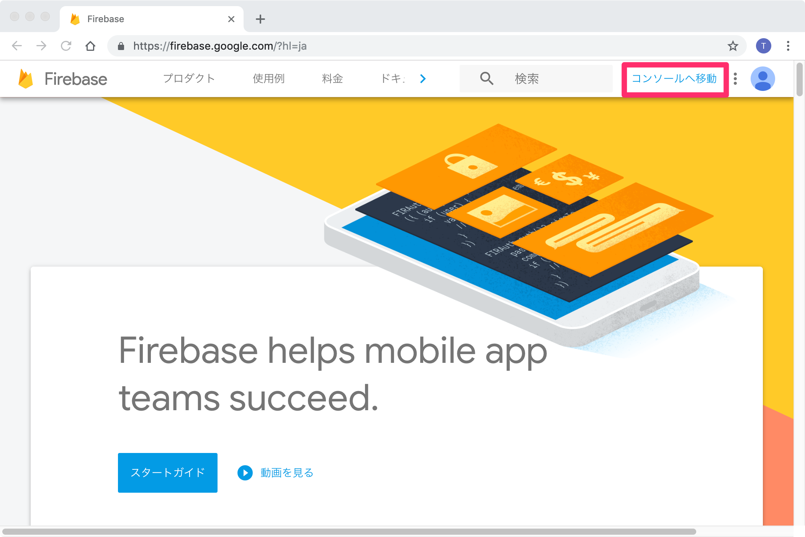
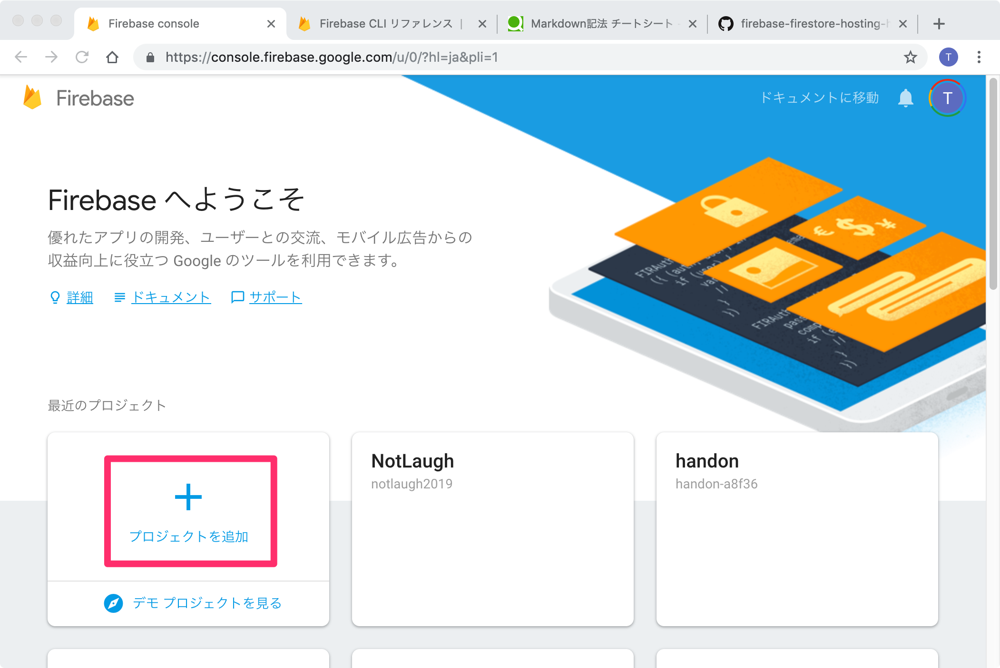
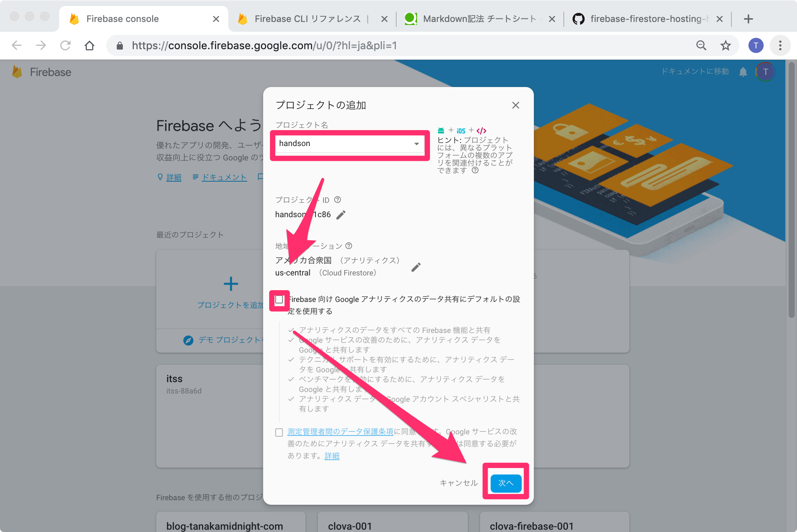
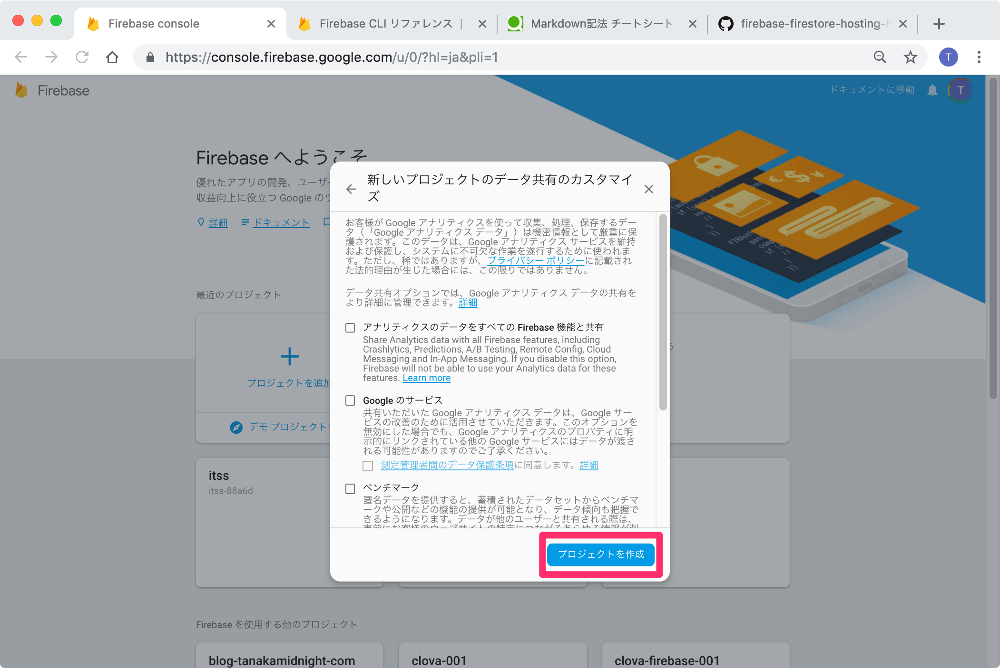
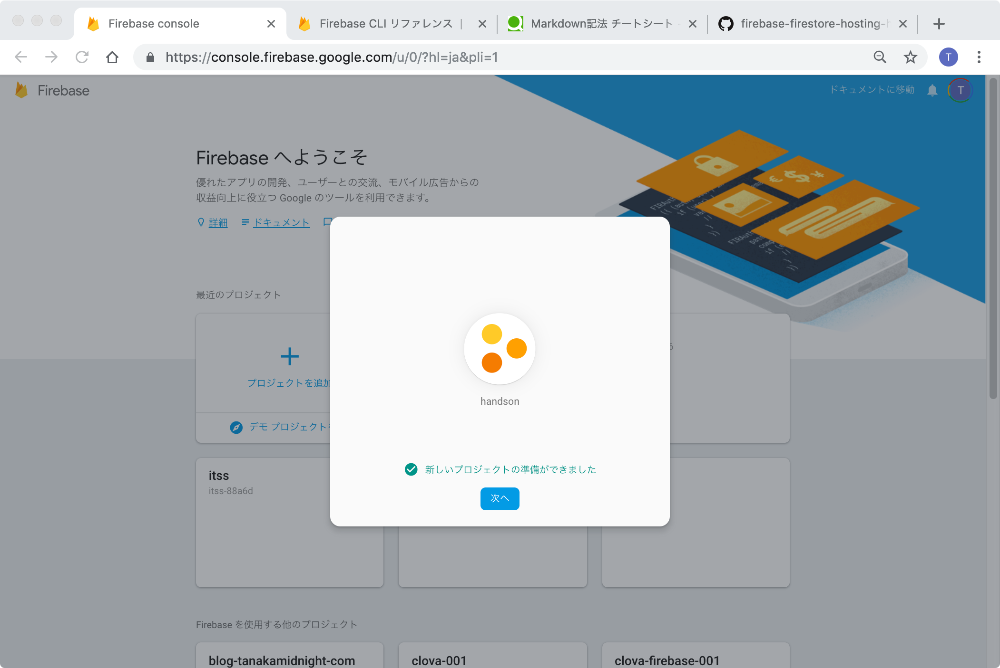

# Step1 Firebase を使うための準備をしよう

## 1.Firebase にログイン

https://firebase.google.com/

## 2.Firebase CLI のインストール

https://firebase.google.com/docs/cli/?hl=ja

Firebase CLI のインストール

```
npm install -g firebase-tools
```

Firebase にログイン

```
firebase login
```

## 3.Firebase プロジェクトを作る

Firebase サイトにアクセスし 「コンソールへ移動」をクリックします。


「プロジェクトの追加」をクリックします。  


「プロジェクトの追加」画面が表示されたらプロジェクト名に「handson」と入力、「Firebase 向け Google アナリティクスのデータ共有にデフォルトの設定を使用する」のチェックを外し、「次へ」をクリックします。  


「データ共有のカスタマイズ」画面が表示されたら、値を変更せず、「プロジェクトの作成」をクリックします。


しばらく待つと、プロジェクトが作成されます。


[Step2 へ](step02.md)
