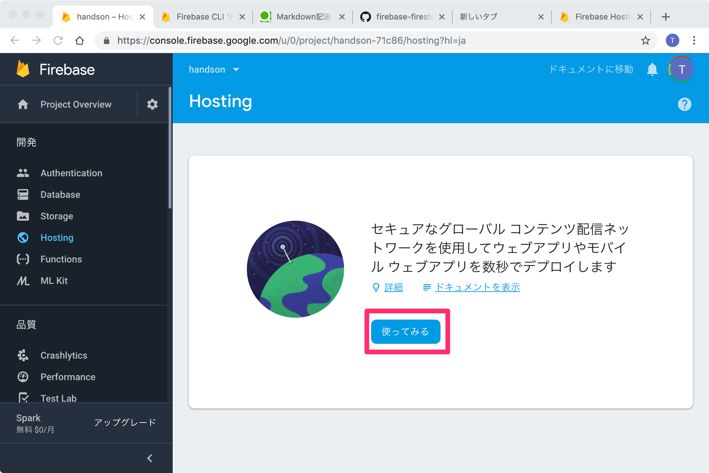
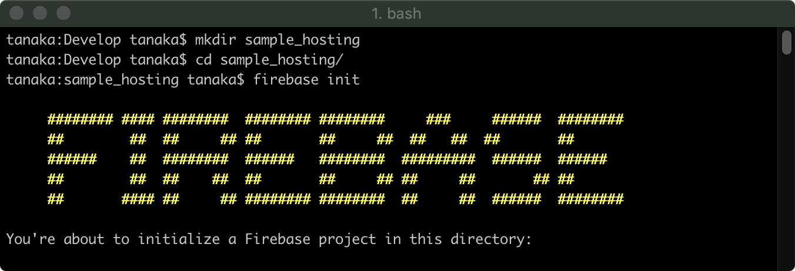
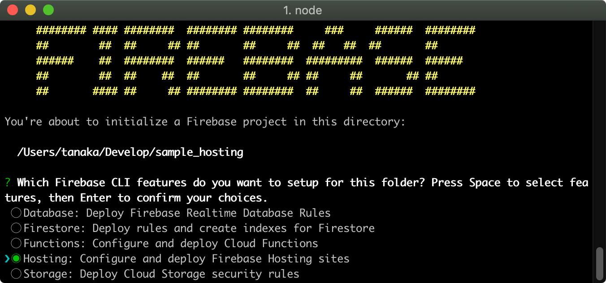
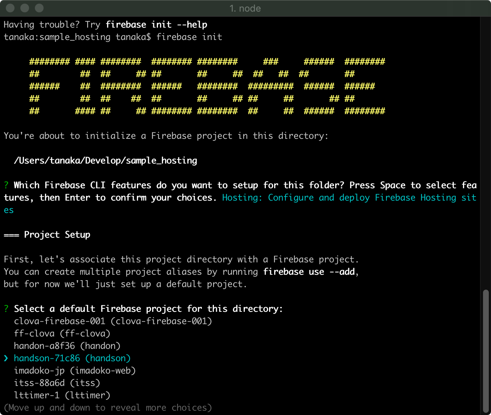
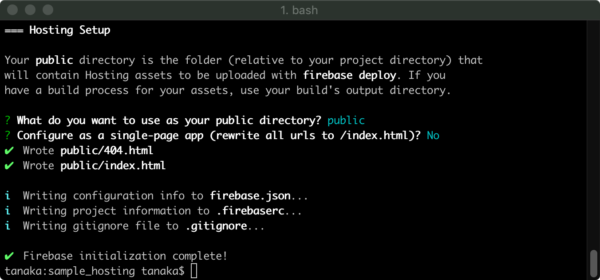
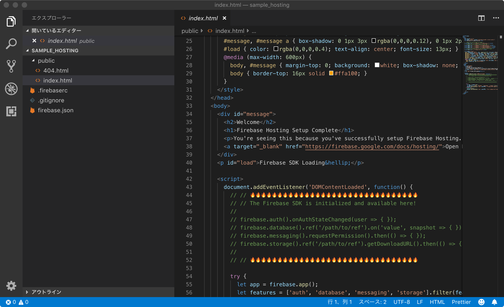
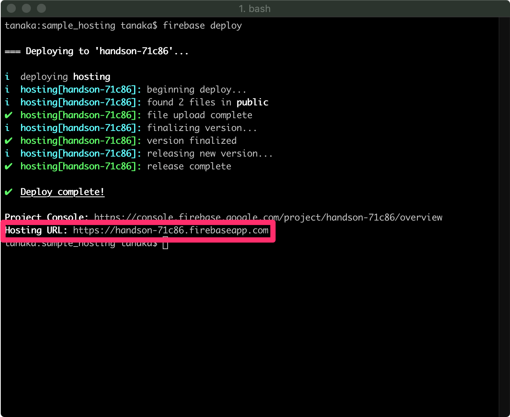
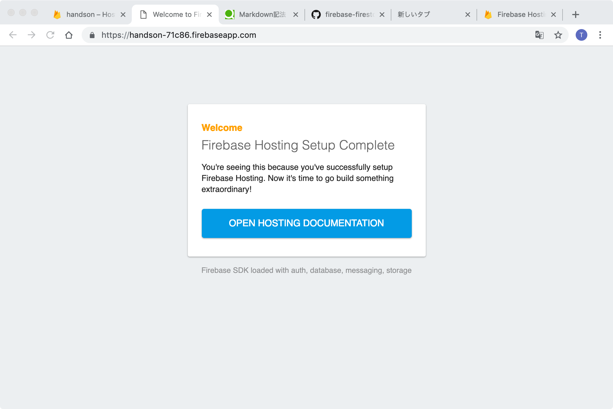
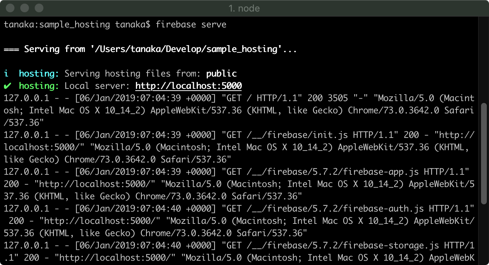

# Step2 静的サイトを作ろう

## 1.Hosting って何

https://firebase.google.com/docs/hosting/?hl=ja

Firebase Hosting は、本番環境レベルのウェブ コンテンツ ホスティングです。  
1 つのコマンドですばやく簡単にウェブアプリをデプロイすることができ、  
静的コンテンツと動的コンテンツの両方をグローバル コンテンツ配信ネットワーク（CDN）に配信できます。  
また、構成が不要な SSL が組み込まれています。

## 2.Hosting の作成

「開発」内の「Hosting」をクリックし、「使ってみる」をクリックします。


ターミナルを起動し、

```
    mkdir sample_hosting
    cd sample_hosting
    firebase init
```

と入力します。



機能の選択  が表示されるので、「Hosting」を選択します。


プロジェクトの選択が表示されるので、先程作ったプロジェクトを選択します。


 ディレクトリの選択と SPA の有無を聞かれるので今回はデフォルトのままにします。


ファイルが作成されます。


## 3.デプロイ

ターミナルを起動し、

```
    firebase deploy
```

と入力します。


「Hosting URL」に記載されている URL にアクセスすると、Web サイトが表示されます。


## 4.ローカル環境での実行

ターミナルを起動し、

```
    firebase serve
```

と入力します。



「Hosting」に記載されている URL にアクセスすると、Web サイトが表示されます。

「Ctrl + C」でローカル環境を終了します。

参考 : https://firebase.google.com/docs/functions/local-emulator?hl=ja

## 5.ちょっと変更してデプロイしてみる

TBD

[Step3 へ](step03.md)
