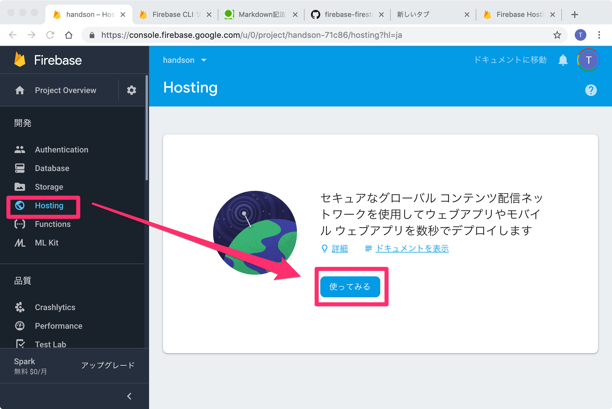
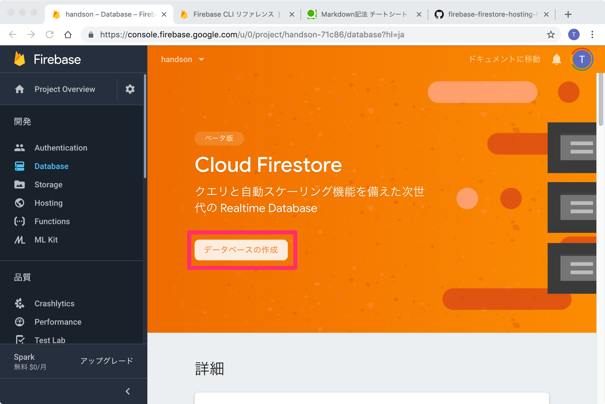
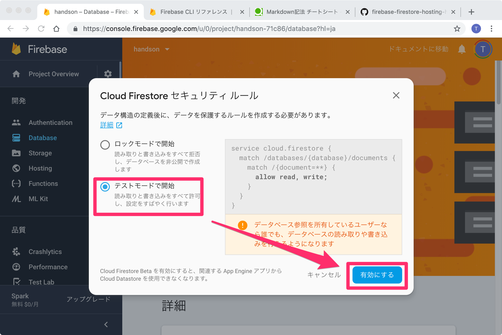
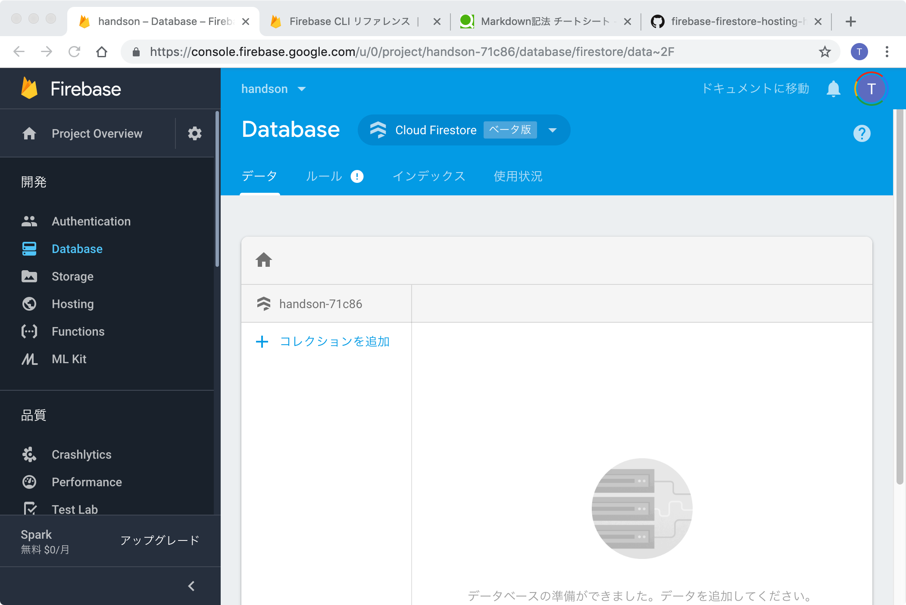

# Step3 DB を作ってみよう

## 1. Cloud Firestore って何？

Cloud Firestore は、Firebase と Google Cloud Platform からのモバイル、ウェブ、サーバー開発に対応した、柔軟でスケーラブルな NoSQL データベースです。  
リアルタイム リスナーを介してクライアント アプリ間でデータを同期し、モバイルとウェブのオフライン サポートを提供します。  
これにより、ネットワークの遅延やインターネット接続に関係なく機能するレスポンシブ アプリを構築できます。

## 2.Cloud Firestore の有効化

「開発」内の「Database」をクリックします。

画面上部「Cloud Firestore」内の「データベースの作成」をクリックします。

「セキュリティルール」画面が表示されたら、「テストモードで開始」を選択し、「有効にする」クリックします。

_テストモードでは誰でもデータの読み書きが可能となっているので後で設定を変更します。テストモードで本番運用するとセキュリティに問題の出ることがあるので気をつけてください。_

しばらく待ち、「Database」画面が表示されます。

## 3.値を入れてたり消したりしてみよう

TBW

[Step4 へ](step04.md)
