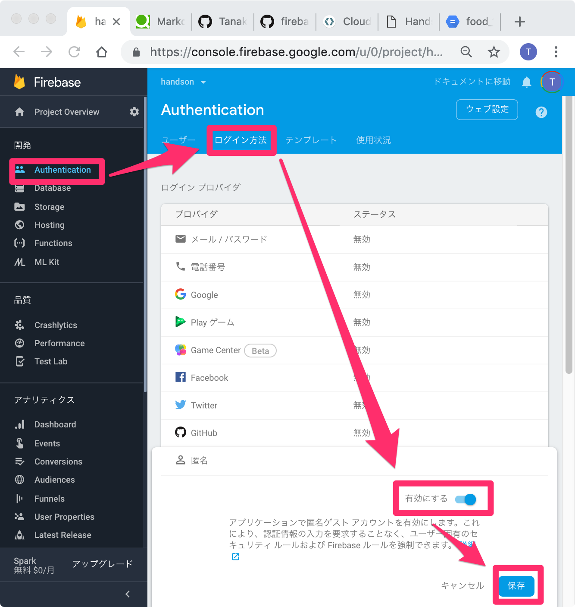
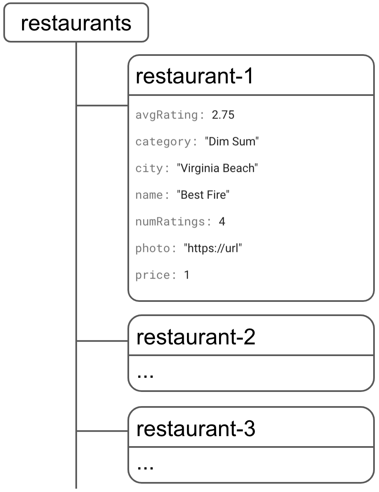
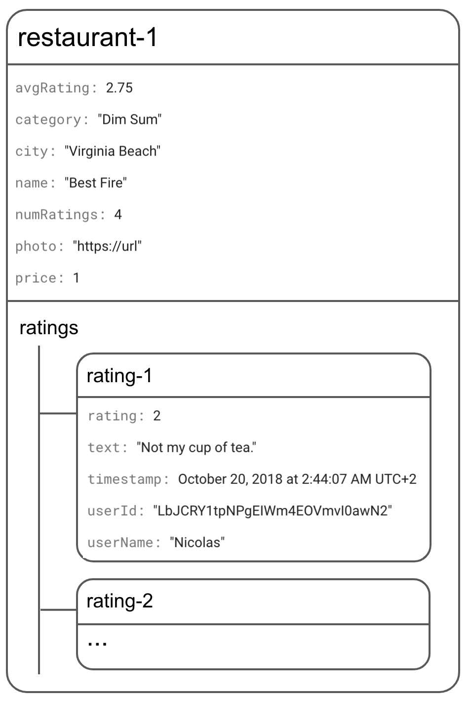

# Step4 サイトと DB を繋いでみよう

ここからは実際の Web アプリを作っていきます。

### 完成イメージ


## 1.匿名ログインの有効化

「開発」内の「Authentication」をクリックします。
「ログイン方法」をクリックします。
「匿名」のステータスを「有効」にして「保存」をクリックします。


匿名ログインの詳細はこちら参照。  
https://firebase.google.com/docs/auth/web/anonymous-auth

## 2.コードの入手

一から作っていくと時間がかかるため、ある程度出来ているコードを取得します。

```
git clone https://github.com/TanakaMidnight/firebase-firestore-hosting-handson-source
cd firebase-firestore-hosting-handson-source
```

## 3.プロジェクトとコードの関連付け

ターミナルから以下を入力します。  
`firebase use --add`  
すると、  
`? Which project do you want to add?`  
と表示されるので先ほど作成したプロジェクトを選択します。

次に、  
`? What alias do you want to use for this project? (e.g. staging)`
と表示されるので  
`default`  
と入力し、関連付けを行います。

## 4.ローカル環境で確認

ローカルで実行して確認してみましょう。  
`firebase serve --only hosting`

## 5.FireStore にデータを書き込む

FireStore にデータを書き込みます。

### データ・モデル

FireStore データは、

- コレクション
  - ドキュメント
    - フィールド
    - サブコレクション

に分割されています。

Restaurants データは以下の通りです。



Ratings データは各 Restaurant のサブコレクションとして格納します。



以下のコードをコメントアウトしてください。

script/models.js(Line 55〜56)
```
const collection = firebase.firestore().collection('restaurants')
return collection.add(data)
```

ブラウザに戻り、ページをリロードします。
「モックデータを追加」ボタンを押下します。

## 6.FireStore からリアルタイムにデータを表示

Firestore からデータを取得してアプリに表示します。

以下のコードをコメントアウトしてください。

script/models.js(Line 21〜24)
```
query = firebase
  .firestore()
  .collection('restaurants')
  .limit(50)
```

ブラウザに戻り、ページをリロードします。

## 7.FireStore から 1 度きりのデータを表示

6.ではリアルタイムで変更があった場合、データが更新されます。  
しかし、常にリアルタイムである必要が無い処理、つまり 1 度だけ取得したい時もあるはずです。  
その場合の書き方について以下で解説します。

以下のコードをコメントアウトしてください。

script/models.js(Line 12〜16)
```
return firebase
  .firestore()
  .collection('restaurants')
  .doc(id)
  .get()
```

ブラウザに戻り、ページをリロードします。  
レストランをクリックすると、詳細画面が表示されるようになります。

## 8.データの並び替えとフィルタリング

データの取得が出来るようになり、リストが表示されるようになりました。

実際のアプリでは、並び替え(ソート)や絞り込み（フィルタ）などが必要になってくると思います。  
その場合の書き方について、以下で解説します。

以下のコードをコメントアウトしてください。

script/models.js(Line 27〜40)
```
if (filters.category && filters.category != '') {
  query = query.where('category', '==', filters.category)
}
if (filters.city && filters.city != '') {
  query = query.where('city', '==', filters.city)
}
if (filters.price && filters.price != '') {
  query = query.where('price', '==', filters.price)
}
if (filters.sort === 'rating') {
  query = query.orderBy('avgRating', 'desc')
} else if (filters.sort === 'review') {
  query = query.orderBy('numRatings', 'desc')
}
```

さらに、並び替えを有効にするにはインデックスを設定する必要があります。

## 9.インデックスの設定

FireStore にインデックスを設定します。

firestore/firestore.indexes.json
```
{
  "indexes": [
    {
      "collectionId": "restaurants",
      "fields": [
        { "fieldPath": "city", "mode": "ASCENDING" },
        { "fieldPath": "avgRating", "mode": "DESCENDING" }
      ]
    },
    {
      "collectionId": "restaurants",
      "fields": [
        { "fieldPath": "category", "mode": "ASCENDING" },
        { "fieldPath": "avgRating", "mode": "DESCENDING" }
      ]
    },
    {
      "collectionId": "restaurants",
      "fields": [
        { "fieldPath": "price", "mode": "ASCENDING" },
        { "fieldPath": "avgRating", "mode": "DESCENDING" }
      ]
    },
    {
      "collectionId": "restaurants",
      "fields": [
        { "fieldPath": "city", "mode": "ASCENDING" },
        { "fieldPath": "numRatings", "mode": "DESCENDING" }
      ]
    },
    {
      "collectionId": "restaurants",
      "fields": [
        { "fieldPath": "category", "mode": "ASCENDING" },
        { "fieldPath": "numRatings", "mode": "DESCENDING" }
      ]
    },
    {
      "collectionId": "restaurants",
      "fields": [
        { "fieldPath": "price", "mode": "ASCENDING" },
        { "fieldPath": "numRatings", "mode": "DESCENDING" }
      ]
    },
    {
      "collectionId": "restaurants",
      "fields": [
        { "fieldPath": "city", "mode": "ASCENDING" },
        { "fieldPath": "price", "mode": "ASCENDING" }
      ]
    },
    {
      "collectionId": "restaurants",
      "fields": [
        { "fieldPath": "category", "mode": "ASCENDING" },
        { "fieldPath": "price", "mode": "ASCENDING" }
      ]
    }
  ]
}
```

画面上でも設定できますが、deployコマンドで設定を適用できます。

```
firebase deploy --only firestore:indexes
```

ブラウザに戻り、ページをリロードします。  
ツールバーの右にあるフィルタボタンをクリックし、正しくフィルタリングできることを確認してください。


## 10. トランザクションの設定

データの不整合を防ぐためにデータの作成、更新、削除時にトランザクションを  貼りたいことがあるはずです。
その場合の書き方について以下で解説します。


以下のコードをコメントアウトしてください。

script/models.js(Line 60〜77)
```
rating.timestamp = new Date()
rating.userId = firebase.auth().currentUser.uid
const collection = firebase.firestore().collection('restaurants')
const document = collection.doc(id)
const newRatingDocument = document.collection('ratings').doc()
return firebase.firestore().runTransaction(function(transaction) {
  return transaction.get(document).then(function(doc) {
    const data = doc.data()
    const newAverage =
      (data.numRatings * data.avgRating + rating.rating) /
      (data.numRatings + 1)
    transaction.update(document, {
      numRatings: data.numRatings + 1,
      avgRating: newAverage
    })
    return transaction.set(newRatingDocument, rating)
  })
})
```

## 11. セキュリティの設定

Step3でデータベースの作成を行いましたが、その際のセキュリティルールで「テストモード」を選択していました。  
この「テストモード」はすべてのユーザーがデータベースの読み書きが行えてしまい、セキュリティに問題が発生しています。  
セキュリティルールを以下で正しく設定します。  
firestore/firestore.rules

```
service cloud.firestore {
  match /databases/{database}/documents {

    // Restaurants:
    //  - 読み取り・作成：認証済ユーザーは可能
    //  - 更新：認証済ユーザーは可能、バリデーションを行う
    //  - 削除：禁止
    match /restaurants/{restaurantId} {
      allow read, create: if request.auth != null;
      allow update: if request.auth != null
                    && request.resource.data.name == resource.data.name
      allow delete: if false;

      // Ratings:
      //  - 読み取り：認証済ユーザーは可能
      //  - 作成：認証済ユーザーでuserIdが一致している場合は可能
      //  - 更新・削除：禁止
      match /ratings/{ratingId} {
        allow read: if request.auth != null;
        allow create: if request.auth != null
                      && request.resource.data.userId == request.auth.uid;
        allow update, delete: if false;
      }
    }
  }
}

```

 ターミナルから以下を入力します。

```
firebase deploy --only firestore:rules
```

以上で完成です。  
お疲れ様でした。
